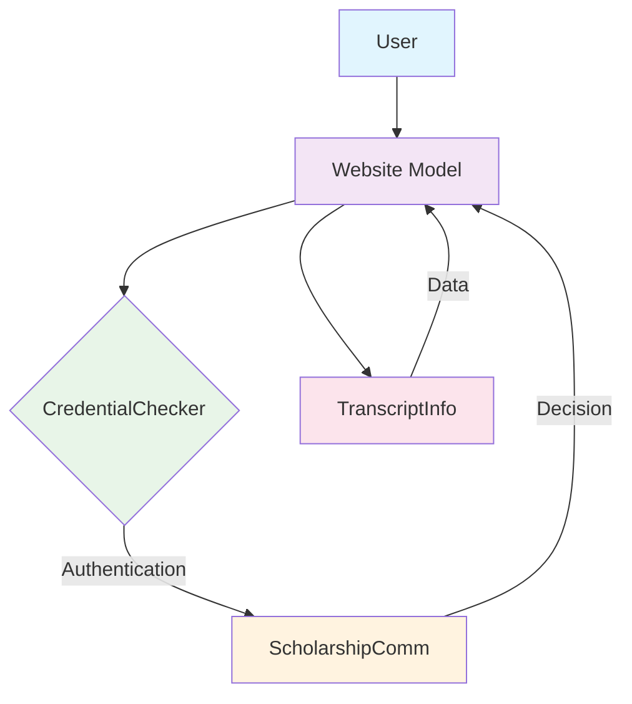

# 🎓 Scholarship Application Portal - UPPAAL Model

## 📋 Overview
A formal verification model for a Scholarship Application Portal developed in UPPAAL, simulating secure user authentication, scholarship application processing, and academic data management with verified safety and liveness properties.

---

## 🏗️ System Architecture

### 🔄 Component Overview


### 📦 Core Components

#### 1. **Website Model** 🌐
- Handles user session management
- Implements login/logout workflows
- Manages scholarship application flow
- Prevents multiple applications per session
- **States:** `login`, `homepage`, `applyScholarship`, `logout`

#### 2. **CredentialChecker Model** 🔐
- Authenticates unique users (ID + password)
- Prevents duplicate logins globally
- **States:** `Waiting`, `Verifying`, `Success`
- **Key Property:** Ensures one active user per session

#### 3. **ScholarshipComm Model** 📑
- Evaluates scholarship eligibility:
  - **Merit Scholarship:** CGPA ≥ 7.0
  - **Merit-Cum-Need:** CGPA ≥ 6.0
- Default test CGPA: 8.0
- **States:** `EvaluatingMerit`, `EvaluatingMCN`, `Approved`, `Rejected`
- Synchronizes application states

#### 4. **TranscriptInfo Model** 📊
- Handles academic data requests
- Simulates academic server integration
- Provides fallback for missing data

---

## ⚙️ Technical Specifications

### 🔧 System Declarations
```uppaal
// System Configuration
Process = Website();
system Process, TranscriptInfo, ScholarshipComm, CredentialChecker;

// Communication Channels
chan scholarshipDecision, scholarshipApplyMerit, transcriptRequest,
     personalInfoRequest, loginRequest, loginResponse, logoutRequest,
     scholarshipApplyMCN;

// Global Variables
int scholarship_approved = 0;
```

### 🎯 Scholarship Eligibility Matrix
| Scholarship Type | Minimum CGPA | Processing State |
|-----------------|-------------|------------------|
| Merit Scholarship | ≥ 7.0 | `EvaluatingMerit` |
| Merit-Cum-Need | ≥ 6.0 | `EvaluatingMCN` |

---

## ✅ Model Verification

### 🟢 **Liveness Properties Verified**
| Property | Description | Status |
|----------|-------------|--------|
| **L1** | `E<> ScholarshipComm.Approved` | ✅ **TRUE** |
| **L2** | `E<> CredentialChecker.Success` | ✅ **TRUE** |
| **L3** | `A<> CredentialChecker.Verifying → CredentialChecker.Waiting` | ✅ **TRUE** |
| **L4** | `E<> ScholarshipComm.Idle → scholarshipApplied` | ✅ **TRUE** |
| **L5** | `Website.login → CredentialChecker.Verifying` | ✅ **TRUE** |
| **L6** | `E<> (ScholarshipComm.Approved || Rejected)` | ✅ **TRUE** |

### 🛡️ **Safety Properties Verified**
| Property | Description | Status |
|----------|-------------|--------|
| **S1** | `A[] !deadlock` | ✅ **TRUE** |
| **S2** | `E[] ScholarshipComm.EvaluatingMerit → scholarshipApplied` | ✅ **TRUE** |
| **S3** | `A[] CredentialChecker.Verifying → CredentialChecker.Waiting` | ❌ **FALSE** |
| **S4** | `E[] ScholarshipComm.scholarshipApplied` | ❌ **FALSE** |
| **S5** | `E[] CredentialChecker.Verifying → is_authenticated` | ✅ **TRUE** |
| **S6** | `E[] CredentialChecker.Verifying → (!is_authenticated || is_authenticated)` | ✅ **TRUE** |

---

## 🧮 Assumptions & Constraints

### 🔐 **Security Assumptions**
1. Each user has unique credentials (ID + password)
2. Authentication occurs via external server
3. Single active session per user
4. No concurrent multi-device logins

### ⚡ **System Constraints**
1. One active user at a time
2. Default CGPA = 8.0 for testing
3. Immediate server responses (no delays)
4. Transcript data assumed available

### 📊 **Data Assumptions**
```json
{
  "test_user": {
    "id": "unique_integer",
    "password": "integer_hash",
    "cgpa": 8.0,
    "transcript_available": true,
    "personal_info_available": true
  }
}
```

---

## 🚀 Getting Started

### **Prerequisites**
- UPPAAL 4.0+ (Download from [uppaal.org](http://uppaal.org))
- Basic understanding of timed automata
- XML model file (`scholarship_portal.xml`)

### **Installation & Usage**
```bash
# 1. Launch UPPAAL
# 2. Load the model XML file
# 3. Verify properties in Verifier tab
# 4. Simulate workflows in Simulator tab
```

### **Verification Commands**
```uppaal
// Example verification queries
E<> ScholarshipComm.Approved
A[] !deadlock
E[] CredentialChecker.Verifying imply CredentialChecker.is_authenticated
```

---

## 📈 Model Features

### **🛡️ Security Features**
- ✅ Unique user authentication
- ✅ Session state management
- ✅ Prevention of duplicate applications
- ✅ Secure credential verification

### **📋 Workflow Management**
- ✅ Separate scholarship pathways
- ✅ CGPA-based eligibility checks
- ✅ Automatic state transitions
- ✅ Consistent session handling

### **🔍 Verification Coverage**
- ✅ Deadlock-free operation
- ✅ Reachability of critical states
- ✅ State consistency checks
- ✅ Property satisfaction analysis

---

## 📊 Results Summary

### **✅ Successful Verifications**
- All liveness properties satisfied (6/6)
- Critical safety properties maintained
- No deadlocks in system
- Consistent state transitions

### **⚠️ Notable Findings**
- Property S3 evaluates to FALSE - Verifying state doesn't always imply Waiting
- Property S4 evaluates to FALSE - scholarshipApplied not persistent globally
- System supports safe concurrency model

---

## 🔮 Future Enhancements

### **🔄 Planned Extensions**
1. **Multi-user Support** - Concurrent user sessions
2. **Real-time Delays** - Network latency modeling
3. **Extended Scholarship Types** - Additional criteria
4. **Enhanced UI Simulation** - Visual state representation
5. **Database Integration** - Persistent data storage

### **🔧 Technical Improvements**
- Add clock variables for timeout modeling
- Implement priority-based scheduling
- Include error recovery mechanisms
- Add logging and audit trails

---

## 📄 License & Usage
This educational project is developed for academic purposes as part of CS F214 at BITS Pilani. The model is intended for learning and research in formal verification methods.

---

## 📚 References
1. UPPAAL Documentation - [uppaal.org/documentation](http://uppaal.org/documentation)
2. Timed Automata Theory
3. Formal Verification in Software Engineering
4. Model Checking Principles

---

<div align="center">
  <strong>🔐 Secure • 🎯 Verified • 🚀 Scalable</strong>
</div>
